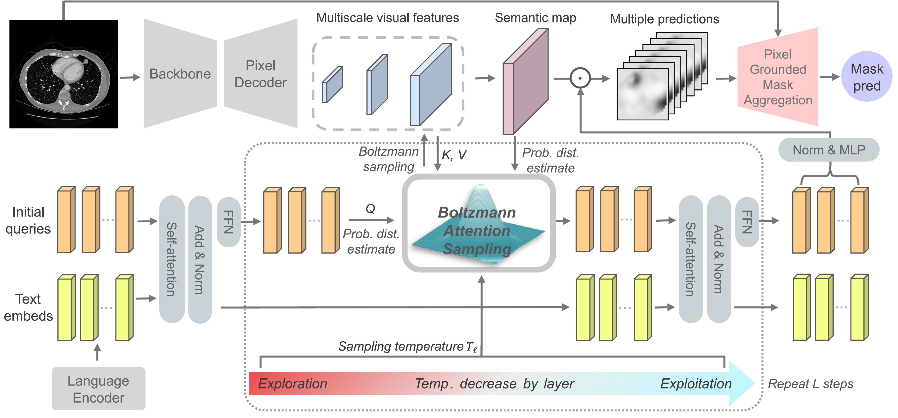
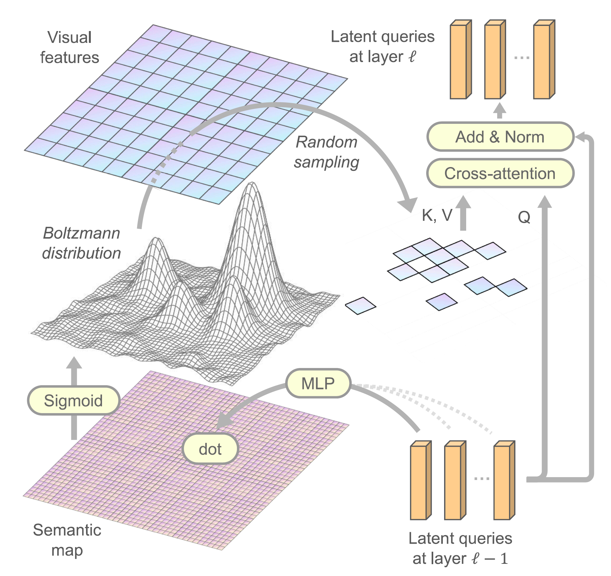
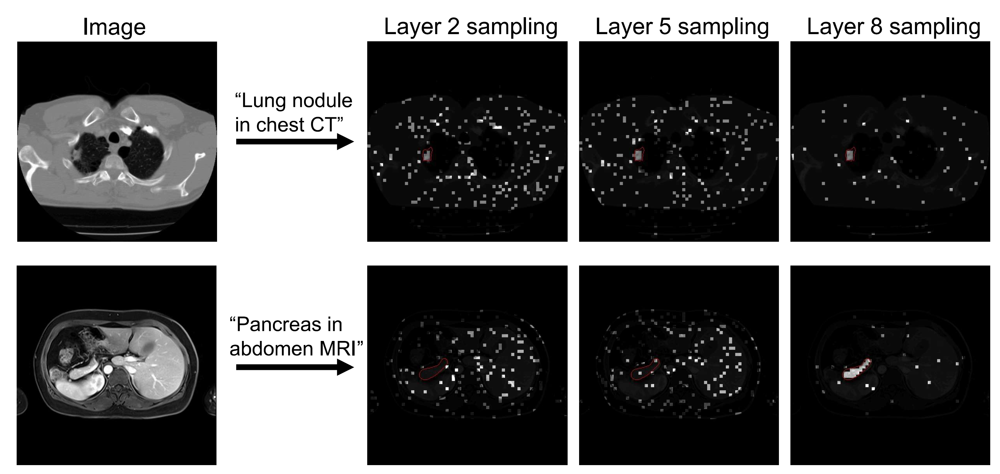

# BoltzFormer

This repository hosts the code for the paper **"Boltzmann Attention Sampling for Image Analysis with Small Objects"** ([*CVPR 2025*](https://arxiv.org/abs/2503.02841)).


**BoltzFormer** is designed for text promptable segmentation, with superior performance for small objects. It performs Boltzmann sampling within the attention mechanism in the transformer, allowing the model to efficiently focus on relevant regions to attend to. BoltzFormer employs an annealing process through the layers to let the model explore then exploit, mimicing a reinforcement learning process within the transformer itself.



**See less, learn more**
Boltzmann attention sampling estimates a probability distribution on the image at every layer, and subsample a small portion of patches to attend to. The model learns to make better "guesses" through the layers, and gradually focus on the region of interest.   

<div style="display: flex; align-items: center;">
  
  
</div>

## Installation
```sh
git clone https://github.com/microsoft/BoltzFormer.git
```

### Conda Environment Setup
```sh
conda create -n boltzformer python=3.10.14
conda activate boltzformer
```

Install dependencies
```sh
pip install -r assets/requirements.txt
pip install git+https://github.com/facebookresearch/detectron2.git
```

## Example Usage
We provide the basic model forward pass usage below. We will release the associated training and evaluation framework soon.

```sh
from PIL import Image
import torch
import numpy as np
import hydra
from hydra import compose
from hydra.core.global_hydra import GlobalHydra

# Initialize Hydra and load configuration
GlobalHydra.instance().clear()
hydra.initialize(config_path="configs", job_name="example_prediction")
cfg = compose(config_name="boltzformer_model")

# Instantiate the model from the configuration
model = hydra.utils.instantiate(cfg, _convert_="object")
```

### Example Input and Output
```sh
# Load an example input image
image = Image.open("examples/01_CT_lung.png").convert("RGB")
image_array = np.array(image, dtype=np.float32)
image_tensor = torch.from_numpy(image_array).permute(2, 0, 1)
print(image_tensor.shape, image_tensor.max(), image_tensor.min())

# ground truth mask
mask = Image.open("examples/01_CT_lung_nodule.png").convert("L")
mask_array = np.array(mask, dtype=np.float32)
mask_tensor = torch.from_numpy(1.0*(mask_array>0)).unsqueeze(0)
print(mask_tensor.shape, mask_tensor.max(), mask_tensor.min())

# example text prompt
text = 'lung nodule in CT scan'
```

```sh
from utils.loss import BoltzFormerLoss

loss_fn = BoltzFormerLoss()

# example input
input = {
    "image": image_tensor.unsqueeze(0),
    "text": [text]
}

# model forward pass
output = model(input, mode="train")

loss = loss_fn(output['predictions']['pred_gmasks'], mask_tensor.unsqueeze(0))
print("Loss:", loss.item())
```
