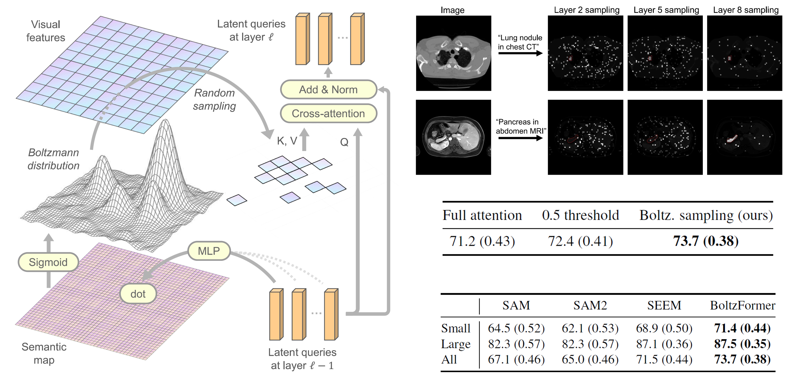

# **Boltzmann Attention Sampling for Image Analysis with Small Objects** ([*CVPR 2025*](https://arxiv.org/abs/2503.02841))

[Theodore Zhao*](https://theodore-zhao.github.io/theozhao/), [Sid Kiblawi*](https://sidkiblawi.github.io/about/), [Naoto Usuyama](https://www.microsoft.com/en-us/research/people/naotous/), [Ho Hin Lee](https://scholar.google.com/citations?user=BsBdSpoAAAAJ&hl=en), [Sam Preston](https://scholar.google.com/citations?hl=en&user=E4FUfrsAAAAJ), [Hoifung Poon](https://scholar.google.com/citations?user=yqqmVbkAAAAJ&hl=en), [Mu Wei‡](https://www.linkedin.com/in/mu-wei-038a3849/)


**BoltzFormer** is designed for text promptable segmentation, with superior performance for small objects. It performs Boltzmann sampling within the attention mechanism in the transformer, allowing the model to efficiently focus on relevant regions to attend to. BoltzFormer employs an annealing process through the layers to let the model explore then exploit, mimicking a reinforcement learning process within the transformer itself.


**See less, learn more**
Boltzmann attention sampling estimates a probability distribution on the image at every layer, and subsamples a small portion of patches to attend to. The model learns to make better "guesses" through the layers, and gradually focus on the region of interest.



## Installation
```sh
git clone https://github.com/microsoft/BoltzFormer.git
```

### Conda Environment Setup
```sh
conda create -n boltzformer python=3.10.14
conda activate boltzformer
```

Install dependencies
```sh
pip install -r assets/requirements.txt
pip install git+https://github.com/facebookresearch/detectron2.git
```

### Use Pretrained Backbones
Initializing the model with image backbone pretrained in [SEEM](https://github.com/UX-Decoder/Segment-Everything-Everywhere-All-At-Once) or [SAM2](https://github.com/facebookresearch/sam2) can significantly speed up the training. The model weights can be downloaded as follows:

```sh
mkdir PretrainedModels
cd PretrainedModels/
wget https://huggingface.co/xdecoder/X-Decoder/resolve/main/xdecoder_focall_last_oq101.pt
wget https://dl.fbaipublicfiles.com/segment_anything_2/072824/sam2_hiera_small.pt
wget https://dl.fbaipublicfiles.com/segment_anything_2/072824/sam2_hiera_base_plus.pt
```

## Example Usage
We provide the basic model forward pass usage below. We will release the associated training and evaluation framework soon.

```python
from PIL import Image
import torch
import numpy as np
import hydra
from hydra import compose
from hydra.core.global_hydra import GlobalHydra

# Initialize Hydra and load configuration
GlobalHydra.instance().clear()
hydra.initialize(config_path="configs", job_name="example_prediction")

model_name = "boltzformer_focal-l" # other options: "boltzformer_hiera-s", "boltzformer_hiera-bp"
cfg = compose(config_name=model_name)

# Instantiate the model from the configuration
model = hydra.utils.instantiate(cfg, _convert_="object")
if model_name == "boltzformer_focal-l":
    # initialize the FocalNet backbone with SEEM pretrained weights for easier finetuning
    model.load_pretrained("PretrainedModels/xdecoder_focall_last_oq101.pt")
```

### Example Input and Output
```python
# Load an example input image
image = Image.open("examples/01_CT_lung.png").convert("RGB")
image_array = np.array(image, dtype=np.float32)
image_tensor = torch.from_numpy(image_array).permute(2, 0, 1)
print(image_tensor.shape, image_tensor.max(), image_tensor.min())

# ground truth mask
mask = Image.open("examples/01_CT_lung_nodule.png").convert("L")
mask_array = np.array(mask, dtype=np.float32)
mask_tensor = torch.from_numpy(1.0*(mask_array>0)).unsqueeze(0)
print(mask_tensor.shape, mask_tensor.max(), mask_tensor.min())

# example text prompt
text = 'lung nodule in CT scan'
```

```python
from utils.loss import BoltzFormerLoss

loss_fn = BoltzFormerLoss()

# example input
input = {
    "image": image_tensor.unsqueeze(0),
    "text": [text]
}

# model forward pass
output = model(input, mode="train")

loss = loss_fn(output['predictions']['pred_gmasks'], mask_tensor.unsqueeze(0))
print("Loss:", loss.item())
```


## Citation
If you use BoltzFormer in your research, please use the following for citation.
```bibtex
@article{zhao2025boltzmann,
  title={Boltzmann Attention Sampling for Image Analysis with Small Objects},
  author={Zhao, Theodore and Kiblawi, Sid and Usuyama, Naoto and Lee, Ho Hin and Preston, Sam and Poon, Hoifung and Wei, Mu},
  journal={arXiv preprint arXiv:2503.02841},
  year={2025}
}
```
